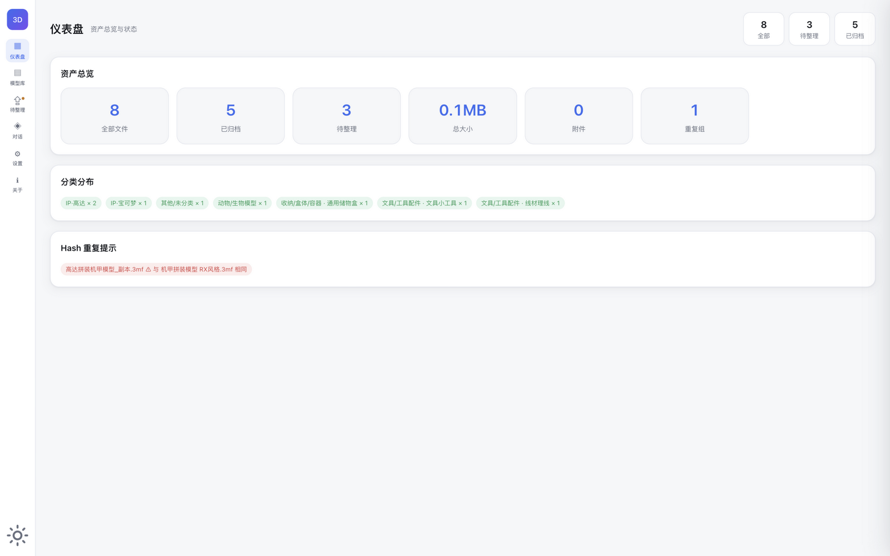
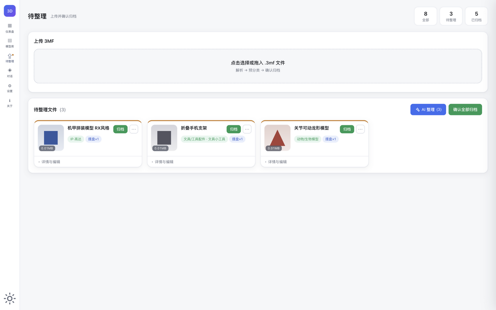
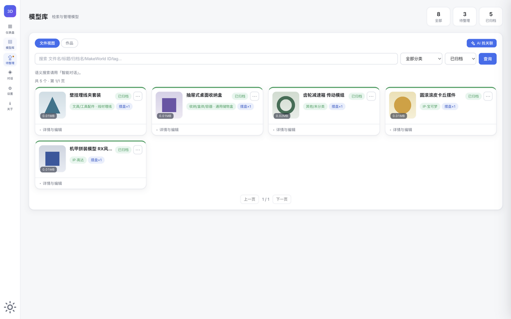
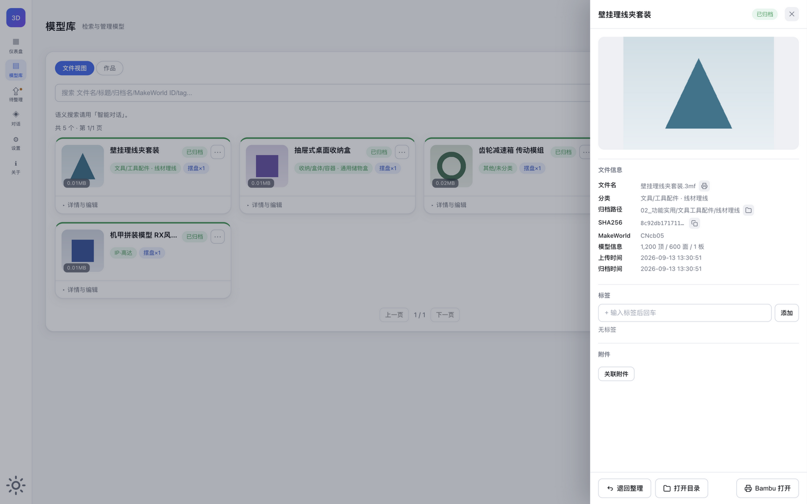
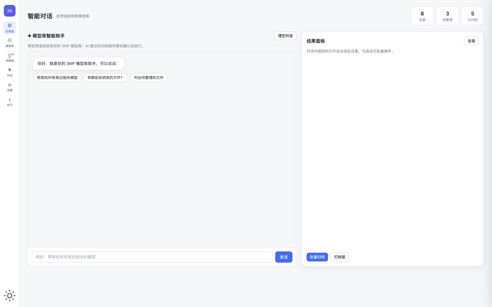

# 3MF Manager

本地 3D 打印文件管理器 — 解析、分类、重命名、检索并整理你本地来自 MakerWorld 的 3MF 文件。

   [](https://github.com/flyingface/3mf_manager/actions/workflows/ci.yml)

**零第三方运行时依赖**（纯 Python 标准库 + SQLite），可选接入任意 OpenAI 兼容的 LLM（本地 Ollama/vLLM、DeepSeek、通义等）获得智能分类、语义检索与多轮对话能力。

## ✨ 功能

| 能力 | 说明 |
|---|---|
| **上传** | 页面拖拽/选择上传 3MF，复制到模型根目录，自动解析 |
| **解析** | 提取标题/作者/设计ID/顶点/三角面/切片/版型（字节级计数，极快） |
| **摆盘缩略图** | 自动提取 3MF 内嵌的模型预览图与各打印板摆盘图，点击放大多板查看（零渲染成本） |
| **预分类** | 规则分类 + 可选 LLM 模型辅助分类；点击 🤖 可填写**自定义分类提示**让 AI 优先按你的要求分类（留空则自动判断，不认识的角色/IP 模型会网络搜索确认），现有分类不满足可**新增分类建议**，确认后执行 |
| **归档** | 一键移动（分类罗盘）+ 按别名重命名，更新后台 SQLite 索引；归档路径可在待整理中手动编辑（支持子目录） |
| **归档路径选择** | 待整理中点击归档路径弹出浮层，从已有目录中选择基础路径并可续输子路径；已归档只读并可在文件管理器中打开 |
| **用 Bambu Studio 打开** | 卡片归档路径行 🖨 按钮，一键调用 Bambu Studio 打开该 3MF 文件（待整理/已归档均可用） |
| **Hash 去重** | 上传时 SHA-256 重复自动检测；「重复」标记仅显示在不可归档的后进副本上，可归档的最早副本不带标记 |
| **Tag** | 每个文件可增删自定义标签，增删时去重且局部更新（不整页刷新） |
| **删除** | 待整理状态可删除，源文件移入回收站（可恢复）、索引一并清除；已归档可「退回整理」 |
| **查询** | 全文/分类/tag/hash/设计ID 搜索，显示本地磁盘绝对路径 |
| **语义搜索 + 对话** | 基于 LLM 的自然语言检索与多轮对话智能体；结果面板按文件状态给出匹配操作（归档/建成分组/加入分组/打标签/清理重复副本/退回整理），AI 提议归档/打标签/建组均需确认后执行 |
| **附件关联** | 可为 3MF 关联非 3MF 附件（打印说明、STL、PDF 等） |
| **文件分组** | 把相关文件（同一模型的部件/变体/重复导出/配件）组成分组：可 AI 扫描建议建组，也可手动「＋ 新建分组」搜索勾选；成员可逐个设置组内角色（★ 主文件每组唯一，组件/变体/配件/重复/其他不限）、添加/移出、重命名、解散分组；只记录关系层，不移动不修改文件本体 |
| **合并导出** | 模型库「多选」勾选 2~20 个模型，一键拼盘合并为 1 个新 3mf：自动并排摆放，新记录进「待整理」并自动建组（新文件为主、原文件为组件）；全程只读源文件 |
| **缩略图** | 上传时自动提取 3MF 内嵌预览图；可 hover 点 📷 上传/更换本地图片（含 Apple 图库 HEIC 自动转 JPEG），预览中点 🗑 可删除 |
| **仪表盘** | 资产总览、分类分布、Hash 重复提示 |
| **设置** | 模型能力（Base URL / Key / 模型名）+ 本地路径可视化配置 |
| **初始化** | 设置页可一键「初始化模型根目录」（需二次确认与路径校验），清空全部数据并重置索引与自增 id，从头开始 |
| **关于** | 左侧一级菜单「关于」，查看功能、使用规则、最近更新与版本信息 |

## 📸 界面预览

浅色 / 深色主题自适应，以下截图由虚拟演示数据生成：

<p>
  
  
</p>
<p>
  
  
</p>
<p align="center">
  
</p>

> 左上起：仪表盘（资产总览 / 分类分布 / Hash 重复提示）· 待整理（上传 / 预分类 / AI 批量整理）· 模型库（检索 / 筛选 / 分页）· 详情抽屉（大图预览 / 文件信息 / 标签附件）· 智能对话（语义检索 + 结果面板批量操作）

## 🚀 快速开始

### 依赖
- Python 3.10+
- [uv](https://docs.astral.sh/uv/)（包管理，可选但推荐）
- macOS / Linux / Windows（集成能力差异见下方「平台差异」）

### 安装与运行

```bash
# 1. 安装依赖（uv 方式，推荐）
uv sync                      # 运行时依赖（零第三方）
uv sync --dev --extra dev    # 含开发依赖（pytest）

# 2. 前台运行（开发）
uv run mfmanager            # 默认 http://127.0.0.1:8000
uv run mfmanager 9000       # 指定端口

# 或直接运行
python3 server.py 8000

# 3. 浏览器打开
open http://127.0.0.1:8000
```

### 后台运行（服务化）+ 一键启停

```bash
./service.sh start      # 启动（后台守护）
./service.sh stop       # 停止
./service.sh status     # 查看运行状态
./service.sh restart    # 重启
./service.sh logs       # 查看日志
```

> `service.sh` 使用 `nohup` 守护进程，PID 与日志落在 `./run/` 与 `./logs/`；重启 Mac 不会自动恢复，开机自启请看 [macOS 使用指南](MACOS.md#开机自启launchd)。

## 🧪 运行测试

```bash
uv sync --dev --extra dev     # 安装 pytest
uv run python -m pytest                 # 全部测试
uv run python -m pytest tests/ -v       # 详细
uv run python -m pytest --cov=.         # 带覆盖率
```

macOS 开机自启示例见 `scripts/com.mfmanager.plist.example`（launchd），安装步骤见 [MACOS.md](MACOS.md#开机自启launchd)。

> 🍎 Mac 用户推荐阅读 [macOS 使用指南](MACOS.md)：后台常驻、开机自启、Bambu Studio 调起、Finder 集成、HEIC 缩略图、Time Machine 备份与常见问题。

## ⚙️ 配置

首次启动在 `设置` 页配置，或复制 `config.example.json` 为 `config.json` 后修改：

```json
{
  "llm": {
    "base_url": "http://127.0.0.1:11434/v1",
    "api_key": "",
    "model": "qwen2.5:14b"
  },
  "paths": {
    "library_root": "~/Downloads/3mf_data"
  }
}
```

- **base_url**：OpenAI 兼容端点。Ollama 填 `http://127.0.0.1:11434/v1`；DeepSeek 填 `https://api.deepseek.com/v1`。
- **model**：模型名，如 `qwen2.5:14b`、`deepseek-chat`。
- **library_root**：模型根目录，上传的 3MF 存 `00_待整理`，归档后按分类放入子目录。

## 📂 目录结构

```
3mf_manager/
├── server.py           # 组合根：HTTP 服务 + 路由表 + LLM 编排（内置 http.server + sqlite3）
├── classify.py         # 分类/别名/目录规划纯逻辑层
├── rules.json          # 分类规则数据（IP 关键词/目录映射/噪音词，可编辑扩充）
├── db.py               # SQLite 存储层（schema 版本化迁移 + 路径/哈希工具）
├── llm_client.py       # OpenAI 兼容 LLM 客户端 + 会话管理
├── parse_3mf.py        # 3MF 解析器（ZIP/XML，字节级几何计数）
├── subcat.py           # 子分类语义（Dummy13/Minecraft/功能父类子类）
├── mc_subcat.py        # Minecraft 子分类
├── runner.py           # CLI 入口
├── version.py          # 版本号单一来源
├── static/index.html   # 前端单页应用
├── tests/              # pytest 测试套件
├── service.sh          # 一键启停脚本
├── pyproject.toml      # uv 打包/依赖配置
├── config.json         # 运行时配置（git 忽略）
├── library.db          # SQLite 索引（自动生成，git 忽略）
├── thumbs/ attachments/ # 运行时产物（git 忽略）
└── LICENSE             # MIT
```

## 📚 文档

- [macOS 使用指南](MACOS.md)
- [架构说明](ARCHITECTURE.md)
- [参与贡献](CONTRIBUTING.md)
- [更新日志](CHANGELOG.md)

## 🔌 API 一览

| 方法 | 路径 | 说明 |
|---|---|---|
| POST | `/api/upload` | 上传并解析、预分类（含 hash 重复检测） |
| POST | `/api/apply` | 确认归档（移动 + 重命名，重复防护） |
| POST | `/api/delete` | 删除文件（源文件进回收站、索引清除） |
| POST | `/api/return-pending` | 退回整理（文件与索引回到 00_待整理） |
| POST | `/api/set-alias` | 设置归档名 |
| POST | `/api/set-target` | 设置归档路径（待整理可改，支持子目录，含安全校验） |
| POST | `/api/recategorize` | 手动重选分类 |
| POST | `/api/tags` | 设标签（去重） |
| POST | `/api/llm-classify` | LLM 模型辅助分类（含新分类建议）；可选 `hint` 字段为自定义分类提示 |
| POST | `/api/confirm-new-category` | 确认 LLM 新分类并落地 |
| POST | `/api/attach` | 关联附件 |
| POST | `/api/attachment-delete` | 删除附件 |
| POST | `/api/groups` | 文件分组：列表 / `create` 建组 / `update` 改名换封面 / `delete` 解散 / `member` 成员增删、角色、主文件、打印状态 |
| POST | `/api/groups/get` | 分组详情 |
| POST | `/api/merge-export` | 合并导出：多选模型拼盘合并为新 3mf，入库并自动建组 |
| POST | `/api/groups/suggest-ai` | 关联建议（确定性聚类 + LLM 判型命名，LLM 不可用自动降级） |
| POST | `/api/thumbnail` | 上传缩略图 |
| POST | `/api/chat` | 多轮对话智能体 |
| POST | `/api/search-llm` | 语义检索 |
| POST | `/api/reset-library` | 初始化模型根目录（清空数据并重置索引） |
| GET | `/api/files` | 查询（q/cat/status/tag/design_id + limit/offset 分页，返回 total，行内嵌 attachments） |
| GET | `/api/dirs` | 列出模型根目录下已存在目录（供归档路径选择） |
| GET | `/api/stats` | 仪表盘统计 |
| GET | `/api/categories` | 分类列表 |
| GET | `/api/about` | 关于说明（Markdown） |
| GET | `/api/config` | 读取配置 |

## 🖥️ 平台差异

核心功能（解析、分类、检索、上传管理）三平台一致，集成能力差异如下：

| 能力 | macOS | Linux | Windows |
|---|---|---|---|
| 文件管理器定位 | ✅ Finder | ✅ xdg-open | ✅ 资源管理器 |
| 打开 3MF 文件 | ✅ 优先调起 Bambu Studio，失败回退默认程序 | ⚠️ 系统默认程序打开 | ⚠️ 系统默认程序打开（将 Bambu Studio 设为 3MF 默认程序即等效） |
| HEIC/BMP/TIFF 缩略图自动转 JPEG | ✅（sips） | ✅（ImageMagick） | ❌ 请先手动转为 JPEG/PNG |
| 开机自启（launchd） | ✅ 见 [MACOS.md](MACOS.md) | ❌ | ❌ |

## 已知限制
- MakerWorld 官网有 Cloudflare 反爬，**自动抓取官方缩略图不可行**，改为用户自行上传。
- 数据库 `library.db` 为单机 SQLite，适合个人使用。

## ⚖️ 免责声明

- 本项目是**本地文件管理工具**，不包含、不分发、也不抓取任何 3MF/模型文件，仓库内无任何受版权保护的模型资产。
- **本项目为非官方工具**，与拓竹科技（Bambu Lab）及其平台 MakerWorld 无任何隶属、合作或赞助关系，亦未经其认证或认可。
- Bambu Lab、Bambu Studio、MakerWorld 等名称与标识为其权利人的商标，本文仅在描述兼容性与互操作时作叙述性引用。
- 你所管理的 3MF 文件版权归原作者所有；获取模型时请遵守来源平台（如 MakerWorld）的服务条款与原作者许可协议（如非商用限制）。
- 本项目按 MIT 许可"原样"提供，不附带任何担保，详见 [LICENSE](LICENSE)。

## 📄 许可
[MIT](LICENSE) © 3MF Manager Contributors
